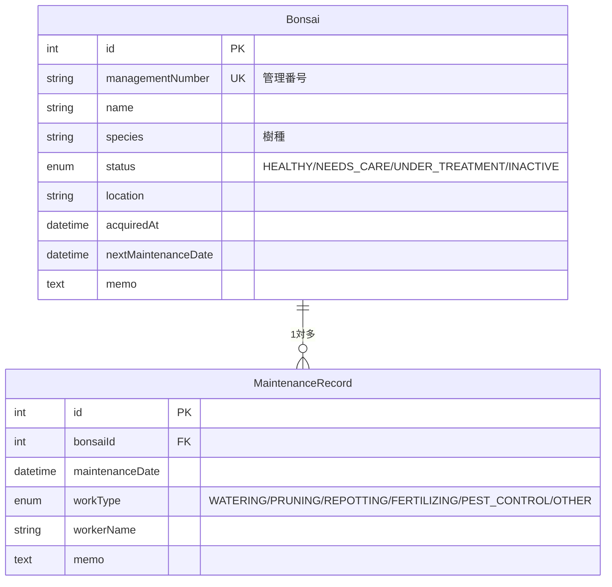

# 盆栽管理アプリ (bonsai-docker-cicd)

> 個人開発ポートフォリオ。実在の盆栽・担当者・顧客情報は使用せず、架空データのみで構成しています。

## 概要

盆栽を管理する担当者が、保有する盆栽の基本情報と手入れ履歴を記録・確認するための社内向け管理アプリです。
Excelでの一覧管理で起こりがちな「更新履歴が残らない」「複数人での同時編集に弱い」といった課題を、
Webアプリ化によって解消することを目的とした個人開発プロジェクトです。

## 作成背景・解決したい課題

- 盆栽の基本情報と手入れ履歴が別々に管理され、1本の盆栽に対する作業履歴を時系列で追いにくい
- Excel運用は変更履歴や入力値検証が弱く、誤入力・重複登録が起きやすい
- Webアプリ化により、一覧・検索・登録・履歴管理を1つの画面体系にまとめる

## 使用技術と採用理由(採用予定)

| 技術 | 理由 |
|---|---|
| Next.js 16 (App Router) / TypeScript | フロントエンド・バックエンドを1つのコードベースで実装でき、Server Actionsで責務を分離しやすいため |
| MySQL 8 + Prisma 7 | リレーショナルなデータ(盆栽 1 : 手入れ履歴 多)を型安全に扱うため。Prisma 7からdriver adapter方式になり、MySQLには`@prisma/adapter-mariadb`(ワイヤプロトコル互換)を使用 |
| Docker Compose | `app`/`db` をコード化し、誰でも同じ環境を再現できるようにするため |
| Zod | サーバー側の入力値検証を型定義と一体化するため |
| Tailwind CSS | 管理画面のUIを素早く一貫したスタイルで組むため |

技術選定の詳細な理由・バージョンは [docs/decisions.md](docs/decisions.md)(今後追加予定)にも記録していきます。

## 機能一覧(今週のMVP: P0)

- [ ] 盆栽情報の一覧・登録・詳細・編集
- [ ] 手入れ履歴の登録・表示
- [x] 盆栽と手入れ履歴の1対多リレーション(DB設計・マイグレーション完了、画面は未実装)
- [ ] 入力値検証(Zod)と例外処理
- [x] Docker ComposeでのNext.js + MySQL起動
- [x] Prisma接続
- [x] 初期ダミーデータ投入(seed)

P1(削除・検索・テスト・CI等)・P2(認証・画像アップロード・デプロイ等)は今回のMVP範囲外です。詳細は Issue を参照してください。

## ディレクトリ構成

```
src/
  app/            # App Router (ルーティング・ページ)
  lib/prisma.ts   # PrismaClientのシングルトン(driver adapter設定含む)
public/           # 静的アセット
prisma/
  schema.prisma   # DBスキーマ定義
  migrations/     # マイグレーション履歴
  seed.ts         # 初期ダミーデータ投入スクリプト
prisma.config.ts  # Prisma CLI(migrate/seed)用の接続設定(Prisma 7から必須)
docker/mysql/init.sql  # dbコンテナ初回起動時の初期化SQL(shadow database作成)
Dockerfile        # app(Next.js)コンテナのビルド定義
compose.yaml      # app・db 2サービスの定義
.env.example      # 環境変数のキー名と安全なダミー値の例
```

## DB設計(ER図)



盆栽1件に対して手入れ履歴を複数件登録できる1対多構成。手入れ履歴が残っている盆栽は
誤って削除できないよう `onDelete: Restrict` を設定している(詳細は`prisma/schema.prisma`のコメント参照)。

## 開発環境の起動手順

### Docker Compose(推奨)

`app`(Next.js)・`db`(MySQL 8)の2サービスをDocker Composeで起動します。

```bash
cp .env.example .env   # 値はダミーのままでもローカル動作可
docker compose up --build
```

http://localhost:3000 で確認できます。ソースコードはbind mountされているため、
`src/`配下を編集すると自動でホットリロードされます(コンテナの再ビルド不要)。

```bash
docker compose down       # 停止(dbのデータは保持される)
docker compose down -v    # 停止 + dbのデータも削除
```

> **依存パッケージを追加・変更した場合の注意**: `node_modules`は匿名volumeでコンテナ内に
> 保持しているため、`docker compose up --build`だけでは古いvolumeの中身が残り反映されないことがある。
> 依存関係を変えたときは `docker compose down && docker compose up --build` を実行する
> (コンテナを作り直すことでvolumeも作り直される)。

`app`コンテナは`db`という**サービス名**をホスト名としてMySQLへ接続します(`localhost`ではありません)。
Docker Composeが作る内部ネットワークでは、サービス名がそのままDNS解決されるためです。

### マイグレーション・seed

`app`コンテナの起動後、別ターミナルで以下を実行してテーブル作成とダミーデータ投入を行います。

```bash
docker compose exec app npx prisma migrate dev --name init   # 初回のみ(以後は npm run db:migrate)
docker compose exec app npm run db:seed                      # ダミーデータ投入(何度実行してもリセットされる)
```

空の状態(volumeなし)から `docker compose up -d --build` → 上記2コマンドで、
毎回同じ状態を再現できることを確認済みです。

`prisma migrate dev`はマイグレーション整合性チェック用の一時データベース(shadow database)を
必要とします。専用ユーザー(`bonsai_user`)は`bonsai`データベースのみの権限に絞っているため、
shadow database作成にはrootを使う`SHADOW_DATABASE_URL`を別途用意しています
(`.env.example`参照)。shadow database自体は`docker/mysql/init.sql`で自動作成されます。

### ローカルNode.js環境(Dockerを使わない場合)

```bash
npm install
npm run dev
```

http://localhost:3000 で確認できます。この場合はMySQLへの接続は別途用意する必要があります。

```bash
npm run lint   # ESLint
npm run build  # 本番ビルド
```

## 今後の予定

1. ~~Docker Compose環境(Next.js + MySQL)~~ ✅ 完了
2. ~~Prisma導入・スキーマ設計・マイグレーション・seed~~ ✅ 完了
3. 盆栽一覧・詳細画面
4. 盆栽登録・編集画面
5. 手入れ履歴の登録・表示実装
6. README・画面画像・工夫した点/苦労した点の追記

## AIを使った範囲(進行中・随時更新)

このプロジェクトは Claude Code を利用しながら開発しています。各Issue・Pull Requestに、AIが担当した部分と本人が確認・判断した内容を記録していきます。
