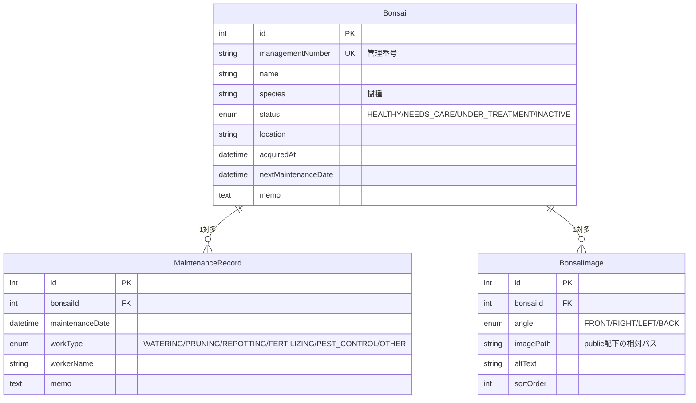

# 盆栽管理アプリ (bonsai-docker-cicd)

> 個人開発ポートフォリオ。実在の盆栽・担当者・顧客情報は使用せず、架空データのみで構成しています。
> **掲載している盆栽の写真はすべて生成AIで作成した架空の画像**であり、実在の盆栽を撮影したものではありません。

## 概要

盆栽を管理する担当者が、保有する盆栽の基本情報と手入れ履歴を記録・確認するための社内向け管理アプリです。
Excelでの一覧管理で起こりがちな「更新履歴が残らない」「複数人での同時編集に弱い」といった課題を、
Webアプリ化によって解消することを目的とした個人開発プロジェクトです。

## 作成背景・解決したい課題

- 盆栽の基本情報と手入れ履歴が別々に管理され、1本の盆栽に対する作業履歴を時系列で追いにくい
- Excel運用は変更履歴や入力値検証が弱く、誤入力・重複登録が起きやすい
- Webアプリ化により、一覧・検索・登録・履歴管理を1つの画面体系にまとめる

## 使用技術と採用理由

| 技術 | 理由 |
|---|---|
| Next.js 16 (App Router) / TypeScript | フロントエンド・バックエンドを1つのコードベースで実装でき、Server Actionsで責務を分離しやすいため |
| MySQL 8 + Prisma 7 | リレーショナルなデータ(盆栽 1 : 手入れ履歴 多)を型安全に扱うため。Prisma 7からdriver adapter方式になり、MySQLには`@prisma/adapter-mariadb`(ワイヤプロトコル互換)を使用 |
| Docker Compose | `app`/`db` をコード化し、誰でも同じ環境を再現できるようにするため |
| Zod | サーバー側の入力値検証を型定義と一体化するため。Server Actionにブラウザを経由しない直接POSTが来ても必ず検証する |
| Tailwind CSS | 管理画面のUIを素早く一貫したスタイルで組むため |

技術選定の詳細な理由や、実装中に遭遇した問題・対応は [docs/issues.md](docs/issues.md) に
Day単位で記録しています。

## 画面一覧

| パス | 内容 |
|---|---|
| `/` | トップ(盆栽一覧への導線) |
| `/bonsai` | 盆栽一覧 |
| `/bonsai/new` | 盆栽の新規登録 |
| `/bonsai/[id]` | 盆栽詳細(手入れ履歴一覧を含む) |
| `/bonsai/[id]/edit` | 盆栽の編集 |
| `/bonsai/[id]/maintenance/new` | 手入れ履歴の登録 |

## 画面画像

Docker Composeで起動すると、上記の画面をすべて実際に操作して確認できます
(起動手順は後述)。スクリーンショットは今後追加予定です。

## 機能一覧(今週のMVP: P0)

- [x] 盆栽情報の一覧・登録・詳細・編集
- [x] 手入れ履歴の登録・表示
- [x] 盆栽ごとの4方向写真（正面・右・左・背面）の表示
- [x] 盆栽と手入れ履歴の1対多リレーション
- [x] 入力値検証(Zod)と例外処理(登録・編集フォーム)
- [x] Docker ComposeでのNext.js + MySQL起動
- [x] Prisma接続
- [x] 初期ダミーデータ投入(seed)

P1(削除・検索・テスト・CI等)・P2(認証・画像アップロード・デプロイ等)は今回のMVP範囲外です。詳細は下記の「今後の改善案」を参照してください。

## ディレクトリ構成

```
src/
  app/
    bonsai/
      page.tsx             # 盆栽一覧
      new/page.tsx          # 盆栽の新規登録
      [id]/page.tsx          # 盆栽詳細(動的ルート、写真ギャラリー・手入れ履歴も表示)
      [id]/edit/page.tsx      # 盆栽の編集
      [id]/not-found.tsx      # 存在しないIDの404表示
      [id]/_components/BonsaiImageGallery.tsx  # 4方向写真ギャラリー
      [id]/maintenance/
        actions.ts              # 手入れ履歴登録のServer Action
        form-state.ts
        new/page.tsx            # 手入れ履歴の登録
        _components/MaintenanceForm.tsx
      loading.tsx             # 読み込み中のスケルトン表示
      error.tsx                # 想定外の例外(DB接続断など)用のエラーバウンダリ
      actions.ts             # Server Actions(盆栽の登録・更新)。"use server"
      form-state.ts           # フォームstateの型・初期値("use server"ファイルは
                               # 関数以外exportできないためactions.tsから分離)
      _components/            # bonsai配下だけで使うUI部品(ルーティング対象外)
        BonsaiForm.tsx          # 登録・編集共用のフォーム(useActionState)
        StatusBadge.tsx
  lib/
    prisma.ts        # PrismaClientのシングルトン(driver adapter設定含む)
    bonsai.ts         # 盆栽のDBアクセス関数(一覧・詳細取得・作成・更新)
    bonsai-status.ts   # ステータスの日本語ラベル・色の対応表
    bonsai-image-angle.ts # 写真の向きの日本語ラベル
    maintenance.ts      # 手入れ履歴の作成関数
    maintenance-work-type.ts # 作業種別の日本語ラベル
    format.ts          # 日付表示などの共通フォーマッタ
    validation/
      bonsai.ts          # 登録・編集フォームのZodスキーマ
      maintenance.ts      # 手入れ履歴フォームのZodスキーマ
public/           # 静的アセット
prisma/
  schema.prisma   # DBスキーマ定義
  migrations/     # マイグレーション履歴
  seed.ts         # 初期ダミーデータ投入スクリプト
prisma.config.ts  # Prisma CLI(migrate/seed)用の接続設定(Prisma 7から必須)
docker/mysql/init.sql  # dbコンテナ初回起動時の初期化SQL(shadow database作成)
Dockerfile        # app(Next.js)コンテナのビルド定義
compose.yaml      # app・db 2サービスの定義
.env.example      # 環境変数のキー名と安全なダミー値の例
```

## DB設計(ER図)



盆栽1件に対して、手入れ履歴と写真をそれぞれ複数件持つ1対多構成です。

**削除時の挙動を関連ごとに変えています（設計判断）**

| 関連 | 設定 | 理由 |
|---|---|---|
| 盆栽 → 手入れ履歴 | `onDelete: Restrict` | 業務記録なので、盆栽と一緒に黙って消えると困る。履歴が残っている盆栽は削除させない |
| 盆栽 → 写真 | `onDelete: Cascade` | 写真は盆栽に完全に付随するデータで、親が消えたら単独で残す意味がない |

写真は `@@unique([bonsaiId, angle])` により、**同じ盆栽に同じ向きの写真が二重登録されない**ようDB側で保証しています。
画像ファイル自体はDBに保存せず、`public/images/bonsai/` に置いたファイルへのパスだけをDBが持ちます。

## 開発環境の起動手順

### Docker Compose(推奨)

`app`(Next.js)・`db`(MySQL 8)の2サービスをDocker Composeで起動します。

```bash
cp .env.example .env   # 値はダミーのままでもローカル動作可
docker compose up --build
```

http://localhost:3000 で確認できます。ソースコードはbind mountされているため、
既存ファイルの編集は基本的に自動でホットリロードされます(コンテナの再ビルド不要)。

```bash
docker compose down       # 停止(dbのデータは保持される)
docker compose down -v    # 停止 + dbのデータも削除
```

> **依存パッケージを追加・変更した場合の注意**: `node_modules`は匿名volumeでコンテナ内に
> 保持しているため、`docker compose up --build`だけでは古いvolumeの中身が残り反映されないことがある。
> 依存関係を変えたときは `docker compose down && docker compose up --build` を実行する
> (コンテナを作り直すことでvolumeも作り直される)。

> **新規ファイル作成時の注意(Windows)**: Windows + Docker DesktopのbindmountはTurbopackの
> ファイル監視が新規作成ファイルを検知しないことがある(既存ファイルの編集は反映されるのに、
> 新しく`.ts`/`.tsx`を追加した直後だけ`Module not found`になる、など)。この場合は
> `docker compose restart app` で解消する。反映されているか不安な場合はサーバーログ
> (`docker compose logs app`)やNetworkタブのレスポンス内容で実際に新しいコードが
> 動いているか確認するとよい。

`app`コンテナは`db`という**サービス名**をホスト名としてMySQLへ接続します(`localhost`ではありません)。
Docker Composeが作る内部ネットワークでは、サービス名がそのままDNS解決されるためです。

### マイグレーション・seed

`app`コンテナの起動後、別ターミナルで以下を実行してテーブル作成とダミーデータ投入を行います。

```bash
docker compose exec app npx prisma migrate dev --name init   # 初回のみ(以後は npm run db:migrate)
docker compose exec app npm run db:seed                      # ダミーデータ投入(何度実行してもリセットされる)
```

空の状態(volumeなし)から `docker compose up -d --build` → 上記2コマンドで、
毎回同じ状態を再現できることを確認済みです。

`prisma migrate dev`はマイグレーション整合性チェック用の一時データベース(shadow database)を
必要とします。専用ユーザー(`bonsai_user`)は`bonsai`データベースのみの権限に絞っているため、
shadow database作成にはrootを使う`SHADOW_DATABASE_URL`を別途用意しています
(`.env.example`参照)。shadow database自体は`docker/mysql/init.sql`で自動作成されます。

### ローカルNode.js環境(Dockerを使わない場合)

```bash
npm install
npm run dev
```

http://localhost:3000 で確認できます。この場合はMySQLへの接続は別途用意する必要があります。

```bash
npm run lint   # ESLint
npm run build  # 本番ビルド
```

## エラー処理・UI

- `loading.tsx`: `/bonsai`配下のページ読み込み中はスケルトンを表示(Next.jsが自動でSuspense境界にする)
- `error.tsx`: DB接続断などの想定外の例外を捕捉するエラーバウンダリ。詳細はサーバーログにのみ出力し、
  画面には汎用メッセージのみ表示(本番ビルドで、ブラウザへスタックトレース等が一切渡らないことを確認済み)
- `not-found.tsx`: 存在しないIDへのアクセスはHTTP 404
- Zodによるサーバー側検証・Prismaの制約違反(重複・外部キー)はすべて利用者向けメッセージへ変換
- 保存中はボタンをdisabledにして二重送信を防止
- スマートフォン幅(375px)で一覧・詳細・登録・編集・履歴登録の各画面を確認。
  一覧テーブルは横スクロール(`overflow-x-auto` + `whitespace-nowrap`)で見切れを防止

## 工夫した点

- **DBアクセスをUIから分離**: 各ページ(Server Component)はDBを直接叩かず、
  `src/lib/`配下の関数(`bonsai.ts`、`maintenance.ts`)経由でのみアクセスする構成にした。
  用途ごとに取得内容を分けた関数(一覧用・編集用・履歴込み詳細用)を用意し、
  必要なデータだけを都度取得するようにしている。
- **サーバー側検証とDB制約の二重防御**: Zodによるフォーム検証に加えて、
  管理番号の一意制約(`@unique`)や手入れ履歴の外部キー制約(`onDelete: Restrict`)を
  DBスキーマ自体にも持たせ、アプリのバグやAPIへの直接アクセスでも不正なデータが
  入らないようにしている。
- **エラー差し戻し時の入力保持**: フォーム検証・重複エラーで差し戻された際も、
  送信済みの値を保ったまま該当項目のエラーだけを表示するようにし、
  利用者が全項目を入力し直さずに済むようにした。
- **開発時と本番時のエラー表示の違いを明示的に確認**: `next build`した本番相当の
  ビルドで意図的にDB接続を切り、ブラウザ側に内部情報(スタックトレース等)が
  一切渡らないことを実地で確認した上でエラーバウンダリを実装している。
- **画像はDBに入れずパスで管理し、リポジトリ用に圧縮**: 画像バイナリをDBに持たせると
  バックアップや転送が重くなるため、ファイルは`public/`に置きパスだけをDBで管理している。
  また元画像(1254px PNG・計42MB)はポートフォリオのリポジトリとしては重すぎるため、
  800px・JPEG(品質82)へ変換して計2MB(約95%削減)に抑えた。

## 苦労した点と解決方法

開発中に実際に発生した問題と対応は [docs/issues.md](docs/issues.md) にDayごとの詳細を
記録しています。特に印象に残ったものを挙げます。

| 問題 | 解決方法 |
|---|---|
| Prisma 7で`schema.prisma`内の接続URL指定が廃止され、既存の知識と違う構成が必要だった | `prisma.config.ts`(CLI用)と`PrismaClient`のdriver adapter(実行時用)に接続情報を分離する新方式を公式ドキュメントで確認して対応 |
| MySQL用の公式Prisma driver adapterが存在しなかった | ワイヤプロトコル互換の`@prisma/adapter-mariadb`を採用 |
| `prisma migrate dev`のshadow database作成にDB作成権限が必要で、最小権限のアプリ用ユーザーでは失敗した | shadow db作成専用にroot接続を分離し、アプリ用ユーザーの権限は`bonsai`データベースのみに維持 |
| Windows + Docker Desktopで新規ファイル追加時だけTurbopackのホットリロードが効かないことがあった | `docker compose restart app`で解消。既存ファイルの編集は問題なし |
| DBアクセスのあるページがビルド時に静的化されようとしてビルドが失敗した | `export const dynamic = "force-dynamic"`を明示し、常に最新のDB状態をリクエスト時に取得するようにした |
| フォームがエラーで差し戻されると、他の入力項目まで空に戻ってしまった | Server Actionの戻り値に送信済みの値を含め、`<form key={...}>`で再マウントさせて反映 |

## 今後の改善案

MVP範囲外として今回は見送った項目です。理由も含めて記載します。

- **盆栽の削除機能・検索/絞り込み**: 応募を優先するため今回は一覧・登録・編集・履歴登録に絞った
- **テスト自動化(Vitest)・GitHub Actions(CI)**: 手動での動作確認は各Dayで実施済みだが、
  自動テストによる回帰防止は今後追加したい
- **認証・権限管理**: 今回は社内向け想定のシンプルな構成のため未実装。実運用ではユーザーごとの
  権限管理が必要
- **画像アップロード(S3等)**: 盆栽の写真管理は元の実務要件にはあったが、公開ポートフォリオの
  MVPとしては対象外とした
- **手入れ履歴の編集・削除**: 現在は登録のみ。誤入力の訂正手段は今後追加したい

## AIを使った範囲

このプロジェクトは Claude Code を利用して実装しました。

- **AIに任せた部分**: 各Dayの実装(コンポーネント・Server Actions・Prismaスキーマ等)の
  コーディング、エラーメッセージやコミットメッセージの文面、公式ドキュメントの調査
- **本人が判断・確認した部分**: 各Dayの要件・優先順位の決定、実装方針(Server Actions採用、
  DBアクセス層の分離、権限設計など)の承認、ブラウザでの実際の動作確認(正常系・異常系・
  レスポンシブ)、GitHub Issue相当の記録([docs/issues.md](docs/issues.md))とPull Requestの
  作成・マージ判断、公開前の実在情報混入チェック
- 各PRの本文に、目的・変更内容・設計判断・動作確認結果を記録しています
